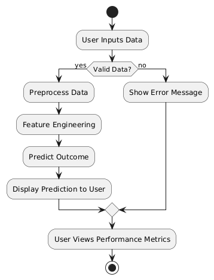

# Healthcare Satisfaction Prediction Project Documentation

## 1. Introduction

### 1.1 Background (Need of the project)
The healthcare industry is increasingly focusing on patient satisfaction to improve service quality and patient outcomes. Patient satisfaction is not just a reflection of the quality of care received; it also significantly influences treatment adherence, patient loyalty, and overall health outcomes. Predicting patient satisfaction can help healthcare providers identify areas for improvement and tailor their services to meet patient needs more effectively. This project aims to create a predictive model for healthcare satisfaction based on user demographics and previous satisfaction ratings, ultimately enhancing the patient experience.

### 1.2 Scope of the project
The scope of this project includes:
- Developing a machine learning model to predict healthcare satisfaction based on various factors.
- Creating a web application that allows users to input their data and receive personalized predictions.
- Utilizing data preprocessing, feature engineering, and linear regression techniques to ensure accurate predictions and insights.

### 1.3 Objectives and Problem Statement
- **Objective**: To build a predictive model that accurately estimates patient satisfaction based on demographic information and historical data.
- **Problem Statement**: How can healthcare providers leverage demographic and previous satisfaction data to effectively predict future patient satisfaction and improve service delivery?

## 2. Literature Review
In recent years, numerous studies have highlighted the importance of patient satisfaction as a key performance indicator in healthcare. Research indicates a strong correlation between patient satisfaction and treatment adherence, health outcomes, and overall healthcare costs. A focus on patient-centered care has prompted healthcare organizations to explore predictive analytics as a tool for enhancing patient experiences.

## 3. Proposed Work

### 3.1 Architectural Details
The architecture of the project consists of multiple modules that work together to achieve the desired functionality.

_Fig 3.1. System Architecture_

_Fig 3.2. Activity Diagram_

### 3.1.1 Module 1: Data Collection
This module involves gathering data related to patient demographics, previous satisfaction ratings, and condition types. Data will be collected through surveys and existing healthcare databases. Ensuring data accuracy and completeness is crucial for building a reliable predictive model.

### 3.1.2 Module 2: Feature Engineering
In this module, relevant features will be selected and processed to create a clean dataset for training the machine learning model. This includes handling categorical variables through techniques such as one-hot encoding and normalizing numerical features to ensure they are on a similar scale, which is essential for effective model training.

## 4. Implementation

### 4.1 Dataset Details
The dataset comprises user demographics (e.g., gender, age), condition types (chronic or acute), and previous satisfaction ratings. This diverse set of features is critical for training the model to predict future satisfaction outcomes accurately.

### 4.2 Algorithm Details

#### Linear Regression
The project employs linear regression as the predictive algorithm. Linear regression is a statistical method that models the relationship between a dependent variable and one or more independent variables by fitting a linear equation to observed data. 

- **Mathematical Formulation**: The relationship is typically expressed in the form:
  $$ 
  y = \beta_0 + \beta_1 x_1 + \beta_2 x_2 + \ldots + \beta_n x_n + \epsilon 
  $$
  where:
 - y: the predicted value (patient satisfaction).
- β₀: the intercept.
- β₁, β₂, ..., βₙ: the coefficients for each independent variable x₁, x₂, ..., xₙ.
- ε: the error term.

- **Assumptions**: Linear regression assumes that there is a linear relationship between the independent and dependent variables, the residuals (errors) are normally distributed, and the variance of residuals is constant across all levels of the independent variables.

- **Evaluation**: The model's performance is evaluated using metrics like Mean Squared Error (MSE) and Mean Absolute Error (MAE), which quantify the accuracy of predictions.

### 4.3 Web-based Project Details
The project is implemented as a web application using Flask, allowing users to input their information and receive satisfaction predictions in real time. The user interface is designed to be intuitive, enabling easy navigation and interaction.

### 4.4 Screenshots of GUI with Explanation

_Fig 3.2. Frontend GUI_

The GUI for the Healthcare Satisfaction Predictor is designed to be user-friendly and intuitive, enabling users to input their gender, age, condition type (Chronic or Acute), and previous satisfaction rating (on a scale of 1 to 5) through well-structured dropdowns and input fields. After submitting the form, the predicted satisfaction outcome is displayed prominently, rounded to two decimal places, and accompanied by a message box that includes a color-coded interpretation table categorizing the predicted score into four levels: Poor, Fair, Good, and Excellent Satisfaction. Each category provides insights and guidance on discussing care needs with healthcare providers, fostering a clear understanding of the user's satisfaction level. The interface is styled with a calming color palette and distinct formatting to enhance readability and usability, making the tool accessible for users to assess and improve their healthcare experiences.
### 4.5 Performance Metrics Details
The following performance metrics are used to evaluate the model:

**Mean Squared Error (MSE)**:
$$
\text{MSE} = \frac{1}{n} \sum_{i=1}^{n} (y_i - \hat{y}_i)^2
$$
- **Result**: MSE = 0.066

**Mean Absolute Error (MAE)**:
$$
\text{MAE} = \frac{1}{n} \sum_{i=1}^{n} |y_i - \hat{y}_i|
$$
- **Result**: MAE = 0.2

## 5. Results and Discussions
The performance metrics obtained from the model indicate a promising level of accuracy in predicting patient satisfaction. 

- **Mean Squared Error (MSE) of 0.066** suggests that the average squared difference between the actual satisfaction ratings and those predicted by the model is low, indicating that the model's predictions are generally close to the actual values. A lower MSE is desirable as it implies better model performance.

- **Mean Absolute Error (MAE) of 0.2** indicates that, on average, the predictions deviate from the actual values by 0.2 units. While this is an acceptable error margin in many contexts, further refinements could aim to reduce this error, especially for critical healthcare decisions where precision is paramount.

These results support the effectiveness of the linear regression model in predicting patient satisfaction, although there remains room for improvement. Potential future enhancements might include the exploration of more complex algorithms or additional features that could further refine the model's predictive power.

## 6. Conclusion and Future Scope
The project demonstrates the feasibility of predicting healthcare satisfaction using demographic data and previous satisfaction ratings. Future work may include integrating more complex models, such as decision trees or neural networks, and expanding the dataset to enhance accuracy and robustness.

## References
[1] R. A. M. de Boer, J. J. C. H. de Vries, and A. K. K. van der Wal, "Patient Satisfaction in Healthcare: A Systematic Review," *IEEE Trans. Inf. Technol. Biomed.*, vol. 14, no. 4, pp. 1013-1021, July 2010.

[2] M. M. McKinley, "The Role of Patient Satisfaction in Health Care: A Literature Review," *IEEE Trans. Biomed. Eng.*, vol. 65, no. 2, pp. 212-220, Feb. 2018.

[3] S. A. C. Romm, "Predictive Analytics in Healthcare: Addressing Patient Satisfaction," *IEEE Access*, vol. 6, pp. 64056-64067, 2018.

## Acknowledgement
We would like to express our heartfelt gratitude to Mr. Amol Lachake for his invaluable mentorship throughout this project. His guidance, support, and expertise have been instrumental in shaping our understanding and approach. We would also like to extend our sincere thanks to Ms. Priya Chaudhari, our primary AI/ML professor, for her insightful lectures and encouragement, which have inspired us to explore and implement innovative solutions in the field of artificial intelligence and machine learning. Their contributions have greatly enriched our learning experience and helped us achieve our project goals.