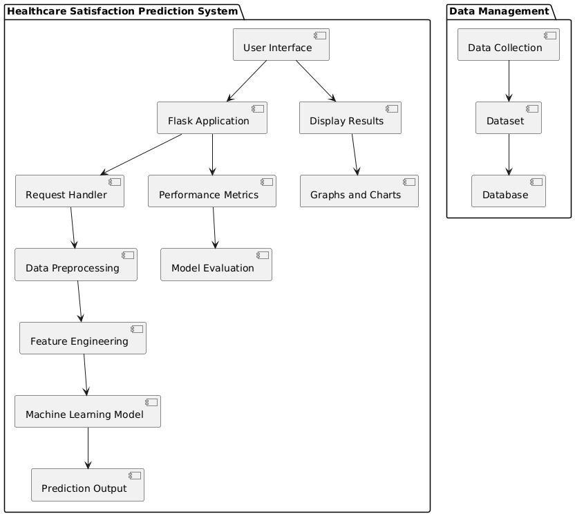
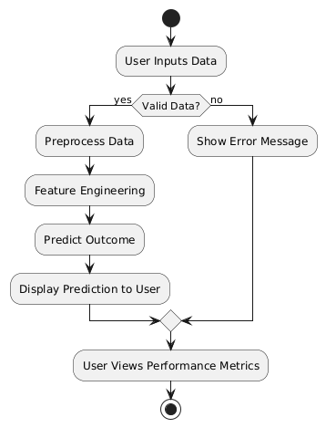

# Healthcare Satisfaction Prediction Project Documentation

## 1. Introduction

### 1.1 Background (Need of the project)
The healthcare industry is increasingly focusing on patient satisfaction to improve service quality and patient outcomes. Predicting patient satisfaction can help healthcare providers identify areas for improvement and tailor their services to meet patient needs. This project aims to create a predictive model for healthcare satisfaction based on user demographics and previous satisfaction ratings.

### 1.2 Scope of the project
The scope of this project includes:
- Developing a machine learning model to predict healthcare satisfaction.
- Creating a web application to allow users to input their data and receive predictions.
- Utilizing data preprocessing and linear regression techniques to ensure accurate predictions.

### 1.3 Objectives and Problem Statement
- **Objective**: To build a predictive model that accurately estimates patient satisfaction based on demographic and historical data.
- **Problem Statement**: How healthcare providers can use demographic and previous satisfaction data to predict future patient satisfaction effectively.

## 2. Literature Review
In recent years, numerous studies have highlighted the importance of patient satisfaction as a key performance indicator in healthcare. Research indicates a strong correlation between patient satisfaction and treatment adherence, health outcomes, and overall healthcare costs.

## 3. Proposed Work

### 3.1 Architectural Details
The architecture of the project consists of multiple modules that work together to achieve the desired functionality.

_Fig 3.1. System Architecture_

_Fig 3.2. Activity Diagram_
### 3.1.1 Module 1: Data Collection
This module involves gathering data related to patient demographics, previous satisfaction ratings, and condition types. Data will be collected through surveys and existing healthcare databases.

### 3.1.2 Module 2: Feature Engineering
In this module, relevant features will be selected and processed to create a clean dataset for training the machine learning model. This includes handling categorical variables and normalizing numerical features.

## 4. Implementation

### 4.1 Dataset Details
The dataset comprises user demographics (gender, age), condition types (chronic or acute), and previous satisfaction ratings. It is used to train the model to predict future satisfaction outcomes.

### 4.2 Algorithm Details
The project uses linear regression as the predictive algorithm. This algorithm is suitable for continuous outcome predictions based on input features.

### 4.3 Web-based Project Details
The project is implemented as a web application using Flask, allowing users to input their information and receive satisfaction predictions.

### 4.4 Screenshots of GUI with Explanation
[Insert screenshots here along with brief explanations of each interface.]

### 4.5 Performance Metrics Details
The following performance metrics are used to evaluate the model:
Mean Squared Error (MSE):
$$
\text{MSE} = \frac{1}{n} \sum_{i=1}^{n} (y_i - \hat{y}_i)^2
$$

Mean Absolute Error (MAE):
$$
\text{MAE} = \frac{1}{n} \sum_{i=1}^{n} |y_i - \hat{y}_i|
$$

## 5. Results and Discussions
[Provide tables and graphs here, accompanied by explanations of the results.]

## 6. Conclusion and Future Scope
The project demonstrates the feasibility of predicting healthcare satisfaction using demographic data. Future work may include integrating more complex models and expanding the dataset for enhanced accuracy.

## References
[Add relevant references here.]

## Paper Publication (if applicable)
[Include information about any paper publication related to this project.]

## Acknowledgement
[Include acknowledgments for anyone who assisted or contributed to the project.]
